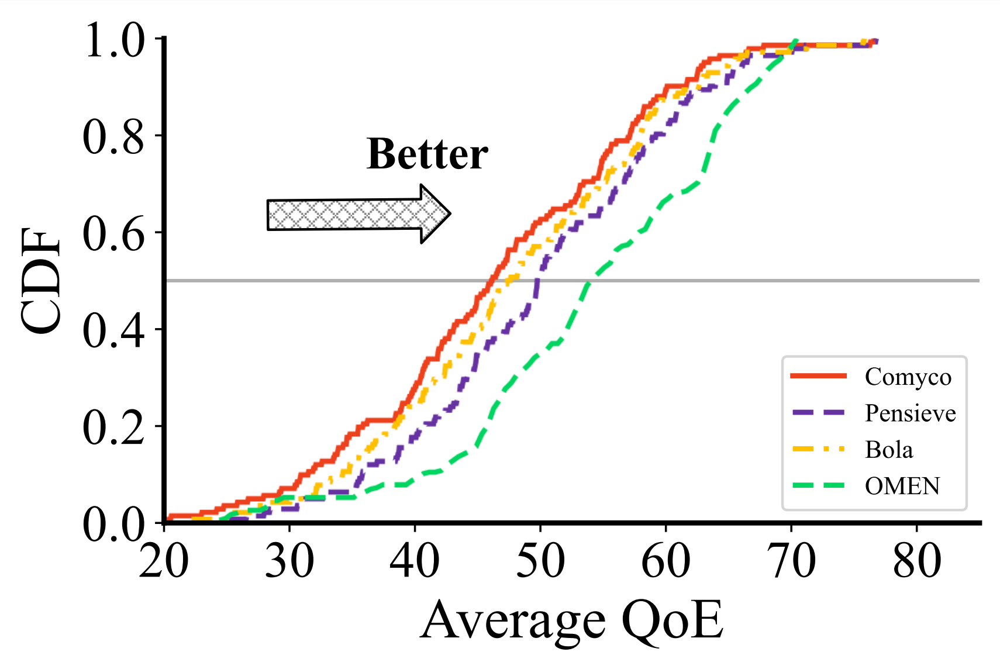
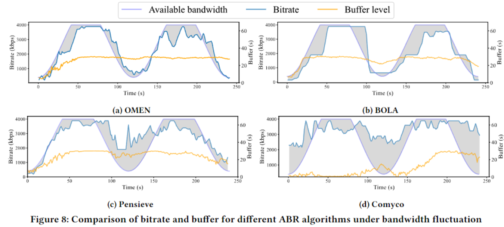

# OMEN

opensource code repo for  《OMEN: Enabling High Precision Adaptive Streaming by Capturing the Congestion Statistics 》

the paper link is ([todo])

## Performance

This graph shows the differences in CDF distribution on the QoE index between OMEN and rule-based BOLA, as well as emerging AI methods such as Comco and Pensieve

It can be seen that OMEN performs better than other methods in the QoE index, especially in the case of high QoE values, where the distribution of OMEN is more clustered, indicating that its performance is more concentrated in the high QoE range; For cases with low QoE values, the distribution may be slightly higher than that of the Pensieve method, but still comparable to other methods.

This graph shows the difference between the selected bit rate and the actual bandwidth of each algorithm under the condition of periodic fluctuations in the actual bandwidth, intuitively represented by the shadow area. As can be seen, OMEN's performance is clearly the smallest in shadow area compared to other algorithms, and in most time periods, its selected bit rate closely matches the true bandwidth, demonstrating better stability.

For more tests on other network conditions and more indicators, please refer to the main text of the paper

## Modules Guide

We will divide the code into several modules, which are:

[modified_abr](modified_abr) : Mainly storing the ABR algorithm part that we modified

[outside_comm](outside_comm) : Mainly stores the relevant code on how to complete the capture of CC data and push the client

[lab](lab) :  Mainly stores some typical experimental data and code

[env](env) : Mainly stores the environment configuration and kernel modification code

We have written specific readme file instructions within each module, please refer to them.

## Tips

Before running the outside_comm module, because it calls the stap script, and in the stap we use, the part that grabs the function call is native and can be run directly. However, the part that grabs the current cwnd, rtt, and ca_state values is the code that our school server modified the kernel and added the grabbing information (which should also be able to obtain this information non invasively, but for convenience, we temporarily chose to modify the Linux kernel directly), so we need to compile the kernel first, replace the kernel with our modified kernel, and then run the outside_comm module.

The specific kernel compilation and replacement methods, as well as the preparation of the stap script, can be referred to in [env](env)